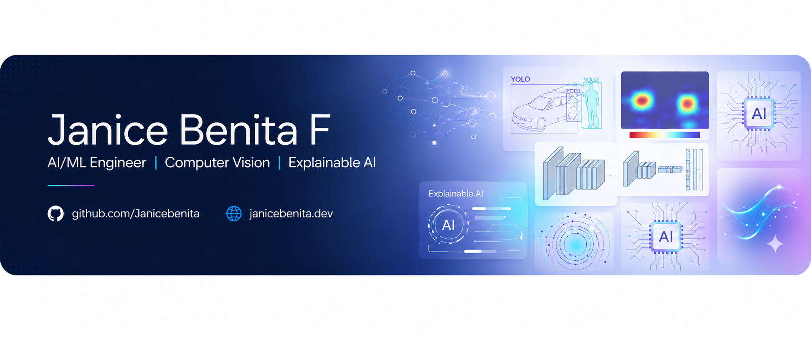

<p align="center">
  
</p>

<h1 align="center">
  Hi 👋 I'm Janice Benita F
</h1>

<h3 align="center">
AI Engineer • Computer Vision • Explainable AI • Intelligent ML Systems
</h3>

<p align="center">
  
</p>

<p align="center">

<a href="https://github.com/Janicebenita">

</a>

<a href="https://www.linkedin.com/in/janice13">

</a>

<a href="mailto:janicebenita123@gmail.com">

</a>

<a href="https://portfolio.com">

</a>

</p>

<p align="center">
  
</p>

---

<p align="center">
  
</p>

---

# 🚀 About Me

🎓 Information Technology Undergraduate specializing in:

- Artificial Intelligence
- Computer Vision
- Explainable AI
- Deep Learning Systems
- Full-Stack Intelligent Applications

🏗️ Industry Experience at **Larsen & Toubro (L&T)** building AI-assisted infrastructure inspection systems.

🔬 Published Research Author in Explainable Deep Learning for automated crack detection using ResNet-18 + Grad-CAM.

⚡ Passionate about designing:

✔️ Real-time AI systems  
✔️ Intelligent detection pipelines  
✔️ Explainable ML architectures  
✔️ Deployment-ready applications  
✔️ Scalable AI solutions  
✔️ Enterprise dashboard platforms  

---

# 🧠 Technical Stack

<div align="center">


<br><br>


</div>

---

# 🔥 Featured AI & Software Projects

---

# 🏗️ AI-Powered Concrete Crack Detection & Localization System

### 🚧 Explainable Infrastructure AI System

<p align="center">
  
  
  
</p>

### 🧠 Hybrid Deep Learning Pipeline

- YOLOv8-based Crack Localization
- ResNet-18 Classification
- Grad-CAM Explainability
- OpenCV Computer Vision
- Flask Deployment System

---

## ✨ System Highlights

✔️ Automated Crack Detection  
✔️ Crack Localization Pipeline  
✔️ Explainable AI Heatmaps  
✔️ Infrastructure Inspection Automation  
✔️ Failure Pattern Identification  
✔️ Real-world Surface Robustness  
✔️ Deployment-oriented ML Workflow  
✔️ Intelligent Visualization Pipeline  

---

## 📊 Real Industry Impact

🚀 Reduced inspection timeline:
### 25–30 Days → 3–5 Days

🚀 Reduced manpower dependency:
### 5 Inspectors → 1–2 Technicians

🚀 Improved infrastructure inspection efficiency using AI-assisted workflows.

---

## 🛠️ AI Workflow

```text
Input Image
      ↓
Image Preprocessing
      ↓
YOLOv8 + ResNet-18 Hybrid Pipeline
      ↓
Detection + Classification
      ↓
Grad-CAM Heatmaps
      ↓
Final Crack Visualization
```

🔗 Repository:
<p align="center">
  <a href="https://github.com/Janicebenita/AI-Powered-Concrete-Crack-Detection-System-with-Explainable-AI-Grad-CAM-">
    
  </a>
</p>

---

# 🌍 Full-Stack NGO Management & MIS Platform

### 📊 Enterprise NGO Operations Dashboard

A scalable management platform designed for NGO workflow automation, project monitoring, and operational visibility.

---

## ✨ Key Features

✔️ NGO Project Lifecycle Management  
✔️ Resource Allocation Tracking  
✔️ MIS Dashboard Analytics  
✔️ User Authentication System  
✔️ Operational Monitoring  
✔️ Project Status Visualization  
✔️ Database-driven Reporting  
✔️ Dashboard-based Decision Support  

---

## 🛠️ Technology Stack

- Flask
- MySQL
- JavaScript
- HTML/CSS
- Dashboard Analytics

---

## 🚀 System Focus

Designed to simulate:

- Real enterprise workflows
- Operational management systems
- Data-driven monitoring platforms
- Organizational resource tracking

🔗 Repository:
[NGO Management Platform](https://github.com/Janicebenita/Full-Stack-NGO-Management-Platform-with-Dashboard-and-Resource-Allocation)

---

# 🔥 Audio-Visual Fire & Smoke Detection System

### 🚨 Real-Time Multimodal AI Detection

Combines:
- Computer Vision
- CNN Audio Classification
- YOLOv8 Detection
- Audio-Visual Fusion
- Emergency Detection Intelligence

---

## ✨ Features

✔️ Real-time Fire Detection  
✔️ Smoke Detection  
✔️ Audio-Visual Fusion  
✔️ Reduced False Positives  
✔️ Live Monitoring Dashboard  
✔️ Intelligent Emergency Alerts  

---

# 📈 Real-Time Stock Trading Signal System

### 📊 Financial Signal Intelligence Platform

Features:
- RSI & Moving Average Strategies
- Telegram Alert Automation
- Real-Time Signal Monitoring
- Time-Series Analytics

---

# 🏢 Professional Experience

# 🏗️ Larsen & Toubro (L&T)

### Data Analytics & Machine Learning Intern

🏗️ Worked on AI-assisted infrastructure inspection systems and explainable computer vision workflows.

### Contributions

✔️ Processed 10,000+ inspection records  
✔️ Built crack detection ML pipelines  
✔️ Developed explainable AI workflows using Grad-CAM  
✔️ Improved inspection automation efficiency  
✔️ Designed deployment-ready AI systems  

---

# 🌾 YuvaIntern

### Machine Learning & Data Analytics Intern

📊 Worked on predictive analytics, machine learning workflows, and data-driven solutions.

### Contributions

✔️ Data preprocessing & feature engineering  
✔️ Exploratory Data Analysis (EDA)  
✔️ Machine learning model development  
✔️ Predictive analytics workflows  
✔️ Visualization & reporting techniques  

---

# 💻 CodeBind Technologies

### Web Design & Development Intern

🌐 Worked on responsive UI/UX design and modern web application development.

### Contributions

✔️ Responsive website development  
✔️ Frontend UI/UX enhancement  
✔️ HTML, CSS & JavaScript development  
✔️ Interactive user interface implementation  
✔️ Web deployment optimization  

---

# 📚 Research Publication

## 📖 Explainable Deep Learning Framework for Automated Concrete Crack Detection Using ResNet-18

Published in:
### International Journal of Engineering Research & Technology (IJERT)

---

# 🏆 Achievements

🏅 600+ DSA Problems Solved  

🏅 Published AI Research Author  

🏅 Code Tutor with 300+ Contributions  

🏅 Runner-Up — CodeVerse Coding Competition  

🏅 Active AI/ML Open Source Contributor  

---

# 📊 GitHub Analytics

<p align="center">


</p>

---

# 📈 Most Used Languages

<p align="center">

</p>

---

# 🌱 Currently Exploring

🧠 Advanced Deep Learning Architectures  

⚡ MLOps & AI Deployment Pipelines  

☁️ AI + Cloud Integration  

🔍 Explainable Computer Vision  

📊 Scalable ML Systems  

---

# 💡 Engineering Philosophy

<div align="center">

### "Building AI systems that are intelligent, explainable, scalable, and impactful."

</div>

---

<p align="center">

✨ Thanks for visiting my profile ✨

</p>
