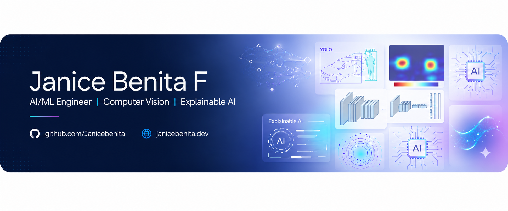

  

<h1 align="center">
Hi 👋 I'm Janice Benita F
</h1>

<h3 align="center">
AI Engineer • Computer Vision • Explainable AI • Industrial Analytics
</h3>

  

---

# 🚀 About Me

I am a B.Tech Information Technology student passionate about developing intelligent systems that solve real-world challenges across healthcare, infrastructure, and industrial analytics.

My work focuses on:

- 🤖 Artificial Intelligence
- 👁️ Computer Vision
- 🧠 Explainable AI (XAI)
- 📊 Data Analytics
- 🏗️ Construction Quality Intelligence
- 🌐 Full-Stack Intelligent Applications

### Areas of Special Interest

🏥 Healthcare AI

🏗️ Infrastructure Inspection & Civil Engineering AI

📊 Industrial Analytics & Six Sigma Intelligence

🧠 Explainable Machine Learning Systems

🚀 AI Product Development & Deployment

---

# 🧠 Technical Stack

## Programming & Development

Python • Java • JavaScript • HTML • CSS • SQL

## Artificial Intelligence & Machine Learning

PyTorch • OpenCV • YOLOv8 • ResNet-18 • Deep Learning • Explainable AI • Grad-CAM

## Data Analytics

Pandas • NumPy • Plotly • Streamlit • Statistical Analytics • Six Sigma

## Deployment & Tools

Flask • Git • GitHub • REST APIs

---

# 🔥 Featured Projects

---

# 📊 Concrete Strength Analytics & Six Sigma Intelligence Platform

### AI-Powered Construction Quality Intelligence Platform

An enterprise-grade analytics system developed for concrete quality evaluation, statistical process control, Six Sigma capability analysis, and risk intelligence.

### Key Capabilities

✅ ACI Acceptance Verification

✅ Sigma Level Evaluation

✅ Cp & Cpk Analysis

✅ Coefficient of Variation Monitoring

✅ Quality Risk Detection

✅ Supplier Performance Benchmarking

✅ Mix Design Analytics

✅ Executive Dashboard Reporting

### Why It Matters

Most projects only verify whether concrete strength meets the specified grade.

This platform goes beyond compliance by identifying:

- Hidden quality variation
- Process instability
- Supplier inconsistencies
- Future quality risks

before they impact project performance.

### Technologies

Python • Streamlit • Pandas • Plotly • Six Sigma Analytics

---

# 🦷 EndoXAI – Explainable AI for Root Canal Treatment Prediction

### Healthcare AI Clinical Decision Support System

An Explainable AI framework developed to assist clinicians in Root Canal Treatment prediction using intelligent diagnostic support.

### Features

✅ Dental X-Ray Analysis

✅ Clinical Decision Support

✅ Explainable AI Visualizations

✅ Treatment Prediction Intelligence

### Focus

Building trustworthy, transparent, and interpretable AI systems for healthcare.

---

# 🏗️ AI-Powered Concrete Crack Detection System

### Published Infrastructure AI Research

An Explainable Deep Learning system developed for automated concrete crack detection and localization.

### Technologies

YOLOv8

ResNet-18

Grad-CAM

OpenCV

Flask

### Highlights

✅ Crack Detection

✅ Crack Classification

✅ Explainable AI Heatmaps

✅ Infrastructure Inspection Automation

### Publication

Published in:

International Journal of Engineering Research & Technology (IJERT)

---

# 🌍 Full-Stack NGO Management & MIS Platform

### Enterprise Operations Dashboard

A complete web-based management system developed for NGO workflow automation and resource tracking.

### Features

✅ Project Lifecycle Management

✅ Resource Allocation

✅ MIS Reporting

✅ Dashboard Analytics

✅ User Authentication

### Technologies

Flask • MySQL • JavaScript • HTML • CSS

---

# 🔥 Audio-Visual Fire & Smoke Detection System

### Real-Time Multimodal AI (Ongoing Project)

Combining:

- Computer Vision
- CNN Audio Classification
- YOLOv8 Detection
- Audio-Visual Fusion
- Emergency Intelligence

### Features

✅ Fire Detection

✅ Smoke Detection

✅ Audio Intelligence

✅ Reduced False Positives

✅ Real-Time Monitoring

---

# 📈 Real-Time Stock Trading Signal Intelligence Platform

### Financial Analytics System

Developed for automated market signal generation using technical indicators and analytics.

### Features

✅ RSI Strategy

✅ Moving Average Signals

✅ Telegram Alerts

✅ Time-Series Analytics

---

# 💼 Professional Experience

## 🏗️ Larsen & Toubro (L&T)

### Data Analytics & Machine Learning Intern

Worked on:

- Construction Quality Analytics
- Infrastructure Inspection Intelligence
- Explainable AI Systems
- Data-Driven Engineering Solutions

---

## 🌾 YuvaIntern

### Data Analytics Intern

Worked on:

- Predictive Analytics
- Data Preprocessing
- Exploratory Data Analysis
- Machine Learning Workflows

---

## 💻 CodeBind Technologies

### Web Development Intern

Worked on:

- Responsive Web Applications
- Frontend Development
- API Integration
- UI/UX Enhancement

---

# 📚 Research Publication

## Explainable Deep Learning Framework for Automated Concrete Crack Detection Using ResNet-18

Published in:

### International Journal of Engineering Research & Technology (IJERT)

---

# 🏆 Achievements

🏅 Published Research Author

🏅 600+ DSA Problems Solved

🏅 AI & Data Analytics Project Developer

🏅 Open Source Contributor

🏅 Runner-Up – CodeVerse Coding Competition

---

# 📊 GitHub Analytics

---

# 📦 Portfolio Highlights

🏥 Healthcare AI

🏗️ Infrastructure AI

📊 Industrial Analytics

🤖 Explainable AI

🌐 Full-Stack Development

📈 Financial Analytics

---

# 🌱 Currently Exploring

🧠 Advanced Deep Learning

⚡ MLOps & AI Deployment

☁️ AI + Cloud Integration

🔍 Explainable Computer Vision

📊 Industrial AI Systems

---

# 💡 Engineering Philosophy

> Building AI systems that are intelligent, explainable, scalable, and impactful.

---

### Connect

GitHub:
https://github.com/Janicebenita

LinkedIn:
https://linkedin.com/in/janice13

---

✨ Thanks for visiting my profile ✨

---

✨ Thanks for visiting my profile ✨

